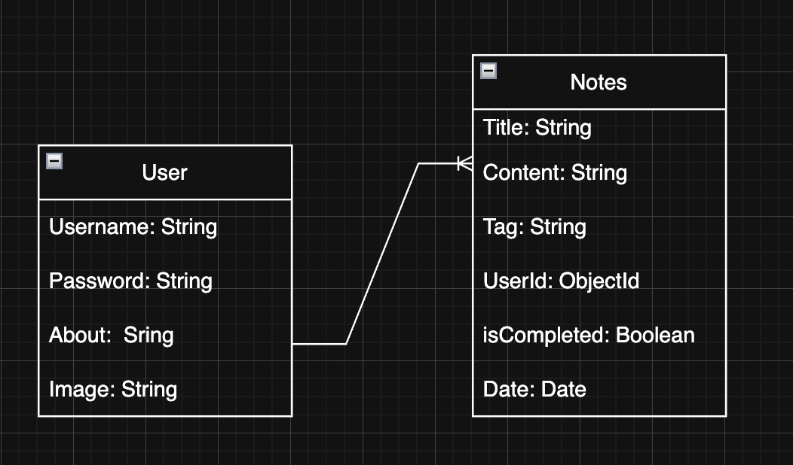
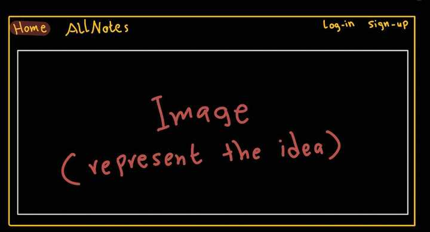
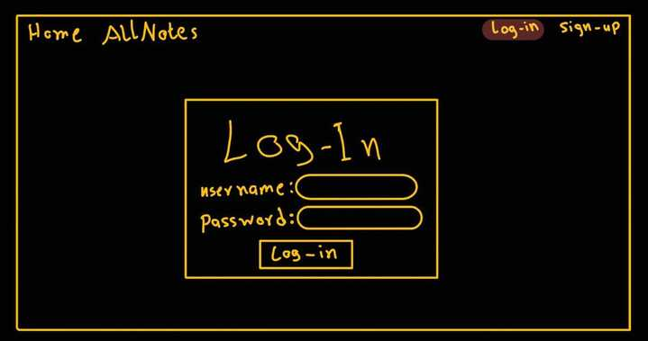
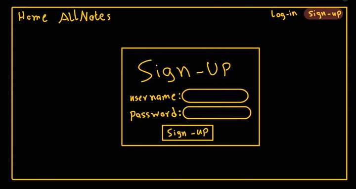
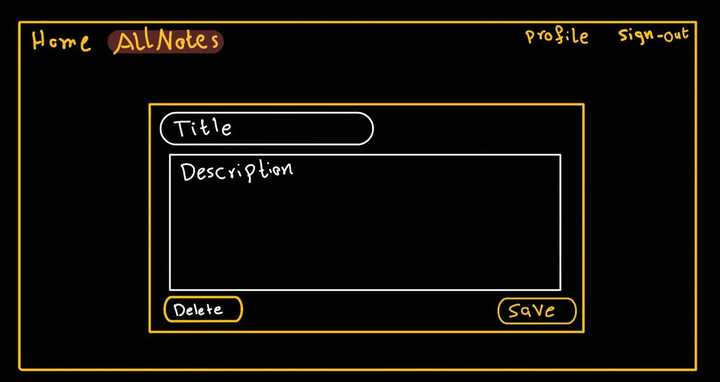
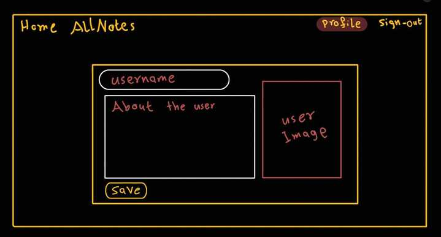
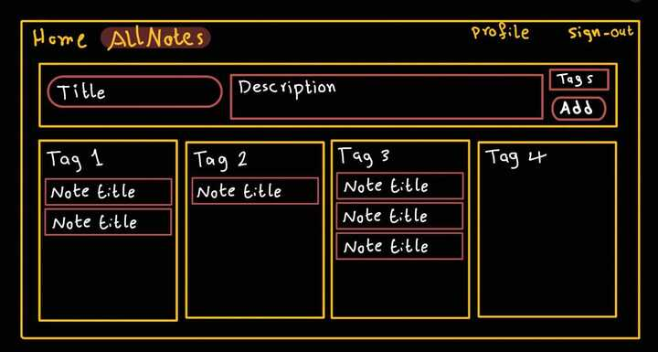

# Project MindNote

## Date: 17/7/2025

### Made By: Mohamed Alsaegh | Qassim Moahammed | Fawaz Ahmed

#### [GitHub](https://github.com/MohamedAlsaegh/Note_Application) | [Trello](https://trello.com/b/EbSMXIDX/my-trello-board) | [MindNote](...)

### **_Description_**

---

MindNote is a full-stack web application designed to help users organize their thoughts and ideas into personalized note sections. Each user's notes are stored securely and displayed only upon login, making this a powerful and intuitive note management tool for everyday use.

### **_Getting Started_**

---

Sign Up as a new user.

Sign In to access your personalized notes dashboard.

Create, view, and manage your notes by category and title.

Your session is secure, and your data is isolated from others.

Visit the deployed project: [MindNote] ()

Explore our development process on [Trello] ()

### **_Technologies Used_**

---

Node.js & Express.js

MongoDB & Mongoose

EJS Templating Engine

Multer (for image uploads)

Sessions and Authentication Middleware

CSS for front-end interactions

### **_ScreenShots_**

---

ERD

---

The Home Page

---

The LogIn Page

---

The SignUp Page

---

Managing your note

---

The profile page

---

The Main Notes View Page

---

### **_Unsolved problems_**

---

Later...

### **_Future enhancements._**

---

Implement search functionality across notes

Allow users to tag and color-code notes

### **_Credits_**

---

This project was developed collaboratively by:

Mohamed Alsaegh

Qassim Mohammed

Fawaz Ahmed

---
